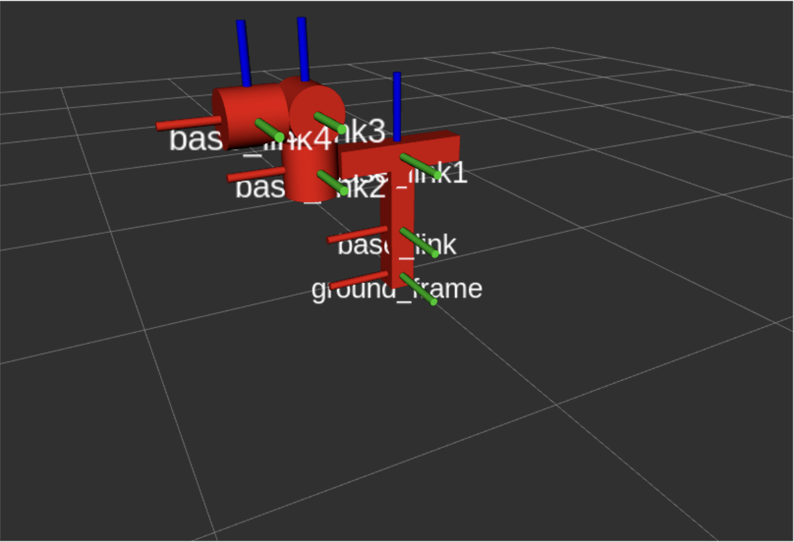
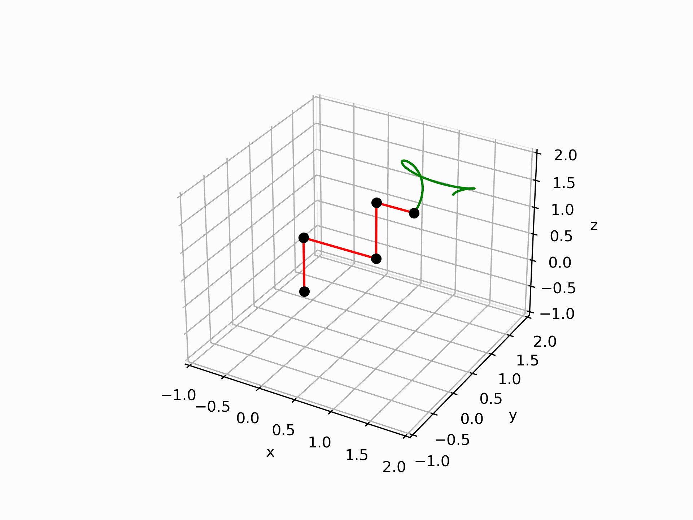

# for.hw
**Fundamentals of Robotics** homeworks repository.

- [for.hw](#forhw)
- [Assignments](#assignments)
  - [Assignment 1 - Spherical Wrist Manipulator ZXZYX](#assignment-1---spherical-wrist-manipulator-zxzyx)
  - [Assignment 2 - Robot Jacobian \& Nullspace](#assignment-2---robot-jacobian--nullspace)
  - [Assignment 3 - Trajectory Planning](#assignment-3---trajectory-planning)
# Assignments

## [Assignment 1](hw1/src/urdf_model/urdf/hw1.urdf) - Spherical Wrist Manipulator ZXZYX

5 DOF manipulator with spherical wrist at the end. Two prismatic and three revolute joints.
## [Assignment 2](hw2/README.md) - Robot Jacobian & Nullspace

An example of a nullspace solution for linear velocities of the end-effector. While the whole mechanism moves, end-effector stays linearly motion-less.
## [Assignment 3](hw3/README.md) - Trajectory Planning

An example of linearized PD-control technique to perform a trajectory planning and execution according to a given desired values of generalized coordinates.