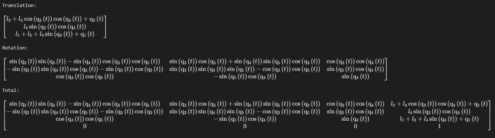
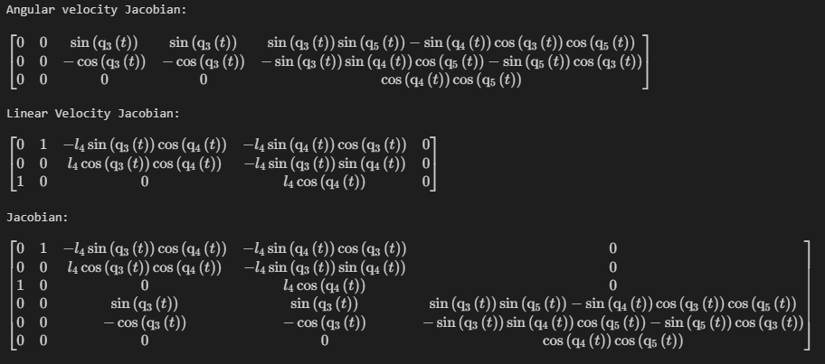
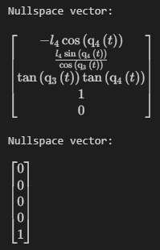
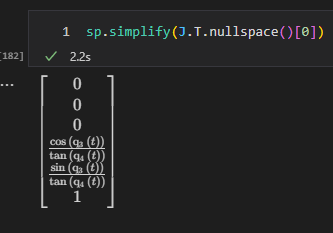

# Assignment 2

- [Assignment 2](#assignment-2)
  - [Current configuration - ZXZYX](#current-configuration---zxzyx)
  - [Mechanism Characteristics](#mechanism-characteristics)
  - [Frame Assignments](#frame-assignments)
  - [DH-Table](#dh-table)
  - [Forward Kinematics](#forward-kinematics)
  - [Jacobians](#jacobians)
  - [Analysis of Jacobian](#analysis-of-jacobian)
    - [General observations](#general-observations)
    - [Nullspace](#nullspace)
    - [Linear Nullspace](#linear-nullspace)
    - [Left Nullspace](#left-nullspace)
  - [Simulation](#simulation)

## Current configuration - ZXZYX

Even though it was not required by an assignment to create a spherical wrist out of revolute joints, after a brief discussion with the TA it seems that it is just slightly better. Therefore I have decided to fix my configuration to suit this recommendation.

## Mechanism Characteristics

1. **Translational Z**: 0.1 x 0.1 x 0.5
2. **Translational X**: 0.1 x 0.1 x 0.5
3. **Revolute Z**: l = 0.2, r = 0.1
4. **Revolute Y**: l = 0.2, r = 0.1
5. **Revolute X**: l = 0.2, r = 0.1

## Frame Assignments

Frame assignments of the ROS configuration should be ignored, since they are placed for convinience of drawing. You can find the actual frame assignments on the following image:

## DH-Table

| Joints | a                | alpha    | d | theta   |
|--------|------------------|----------|---|---------|
| 1      | 0                | 0        | 0 | 0       |
| 2      | pi / 2           | pi / 2   | 0 | d1 + l1 |
| 3      | 0                | - pi / 2 | 0 | d2 + l2 |
| 4      | -pi / 2 + theta1 | pi / 2   | 0 | l3      |
| 5      | pi / 2 + theta2  | pi /  2  | 0 | 0       |
| 6      | theta3           | 0        | 0 | l4      |

## Forward Kinematics

Having completed DH-Table, we can now calculate the forward kinematics easilly following the conventions:

$$T^{n-1}_{n} = Z_{n-1} \cdot X_{n}$$

Where:

$$Z_{i} = T_{z_i}(d_i) \cdot R_{z_i}(\theta_i)$$
$$X_i = T_{x_i}(r_i) \cdot R_{x_i}(\alpha_i)$$

$$T = T^0_1 \cdot T^1_2 \cdot T^2_3 \cdot T^3_4 \cdot T^4_5 \cdot T^5_6$$

Knowing the form of translation and rotation matrices, we can simply plug in the values of the DH table and calculate the transformation matrix. The result is as follows:

(unfortunately, I was not able to find a way to display the matrix in a nice way, so I have decided to just display the image)

## Jacobians

For convenience, I have decided to split the jacobian into two parts: the linear and the angular part. The linear part is calculated simply as derivatives of position, while the position we can simply calculate using the forward kinematics. The angular part is calculated using axis of rotations of the joints.

Simply put, while some joint is rotating about axis $z$, we need to express this axis w.r.t. the base frame (ground frame in our case) which is simple matrix multiplication by a rotation matrix which can be as well expressed through the forward kinematics.

Therefore, the linear part of the jacobian is:

$$J_{linear} = \begin{bmatrix} \frac{\partial x}{\partial q_1} & \frac{\partial x}{\partial q_2} & \frac{\partial x}{\partial q_3} & \frac{\partial x}{\partial q_4} & \frac{\partial x}{\partial q_5} \\ 
\frac{\partial y}{\partial q_1} & \frac{\partial y}{\partial q_2} & \frac{\partial y}{\partial q_3} & \frac{\partial y}{\partial q_4} & \frac{\partial y}{\partial q_5} \\ 
\frac{\partial z}{\partial q_1} & \frac{\partial z}{\partial q_2} & \frac{\partial z}{\partial q_3} & \frac{\partial z}{\partial q_4} & \frac{\partial z}{\partial q_5} \end{bmatrix}$$

While the angular part is:

$$J_{angular} = 
\begin{bmatrix} 
\hat{\omega_1} & \hat{\omega_2} & \hat{\omega_3} & \hat{\omega_4} & \hat{\omega_5} \\
\end{bmatrix}$$

Where each omega is the axis of rotation of the joint expressed in the base frame.

With the corresponding calculations we get the following result:

## Analysis of Jacobian

### General observations

We can see that we did not make any major mistake in calculating the transformations or Jacobian, since we can see that, for example, $oX$ linear velocity of the end effector is linearly dependent on the velocity of the corresponding prismatic joint. As well for $oY$. However, we can see that the $oZ$ linear velocity is not linearly dependent on any of the joints, which is expected, since the end effector is not moving in the $oZ$ direction by any of them.

### Nullspace

We can analyse the nullspaces of the Jacobian to get a general understanding of the manipulator. For example, there is no nullspace other solutions other than zeros for the Jacobian nullspace, meaning that there is no such configuration of joints which will persist both angular and linear velocities of the end effector.

### Linear Nullspace

However, if we analyse only linear part of the Jacobian, we can see that there are two vectors which span the vector space of movements, which allow the end effector to have zero linear velocity along any axis.

As we can see, for example, if we allow only effort by the last revolute joint, our end effector linear velocity will be zero along any axis, which is definitely true if we look at the mechanism. As well as any linear combination of these two vectors will also result in zero linear velocity of the end effector.

### Left Nullspace

Frankly speaking, I am not sure what was needed to be done here. I was able to find the following information:

 If we wish to solve the inverse kinematics problem - there are multiple solutions. For example, we could use (pseudo-)inverse of the Jacobian. This can be quite intuitively done with numerical calculation. However, we will introduce errors in the system and we have to somehow deal with them. 

In other words it is called *drift* phenomena. The drift is the difference between the desired and the actual position of the end effector. The drift is caused by the fact that the inverse kinematics problem is not solvable in closed form. Therefore, we have to use iterative methods to solve it.

Given that 
$$\textbf{e} = \textbf{x}_d - \textbf{x}_e$$
Differentiating we get 
$$\dot{\textbf{e}} = \dot{\textbf{x}_d} - \dot{\textbf{x}_e}$$
I.e. 
$$\dot{\textbf{e}} = \dot{\textbf{x}_d} - \textbf{J}(\textbf{q})\dot{\textbf{q}}$$

Given that Jacobian is square and non-singular, we can calculate 

$$\dot{\textbf{q}} = \textbf{J}^{-1}(\textbf{q})(\textbf{x}_d - \textbf{Ke})$$

Where $\textbf{K}$ is a positive definite matrix. Introducing this matrix we can construct it in such a way that an error will decay and converge over time. We can even tune the convergence rate.

However we can introduce a more computationally friendly algorithm, by considering transpose instead of inverse. Of course, they are not equal, but we can make it work. The most interesting part here is that we should now consider **left null space** of the Jacobian. Since after some transformations and derivations it happens this way, that if $\textbf{Ke}$ belongs to the nullspace of Jacobian transpose, then we get a zero acceleration of the end effector, as far as I understand, while still not reaching the desired position. As a result, our algorithm stucks at the erroneous position.

$$\dot{V} = \textbf{e}^T\textbf{K}\dot{\textbf{x}}_d - \textbf{e}^T\textbf{KJ(q)}\textbf{J}^T\textbf{Ke}$$

Moreover, my mechanism has non-empty left nullspace of the Jacobian, as a result, in case of numerical calculation of inverse kinematics I have to carefully consider it in order to avoid the algorithm death.

## Simulation

After we found the nullspace of the Jacobian, we can use it to simulate the movement of the mechanism to check the correctness of the transformations, jacobian and nullspaces simulatneously. The simulation is as follows:

As we can see, the mechanism is moving as expected, which means that we did not make any major mistake in the calculations. Moreover, the end-effector, which frame coincides with the frame of the third revolute stays at the same position all the time. Therefore nullspace and jacobian are correct.
