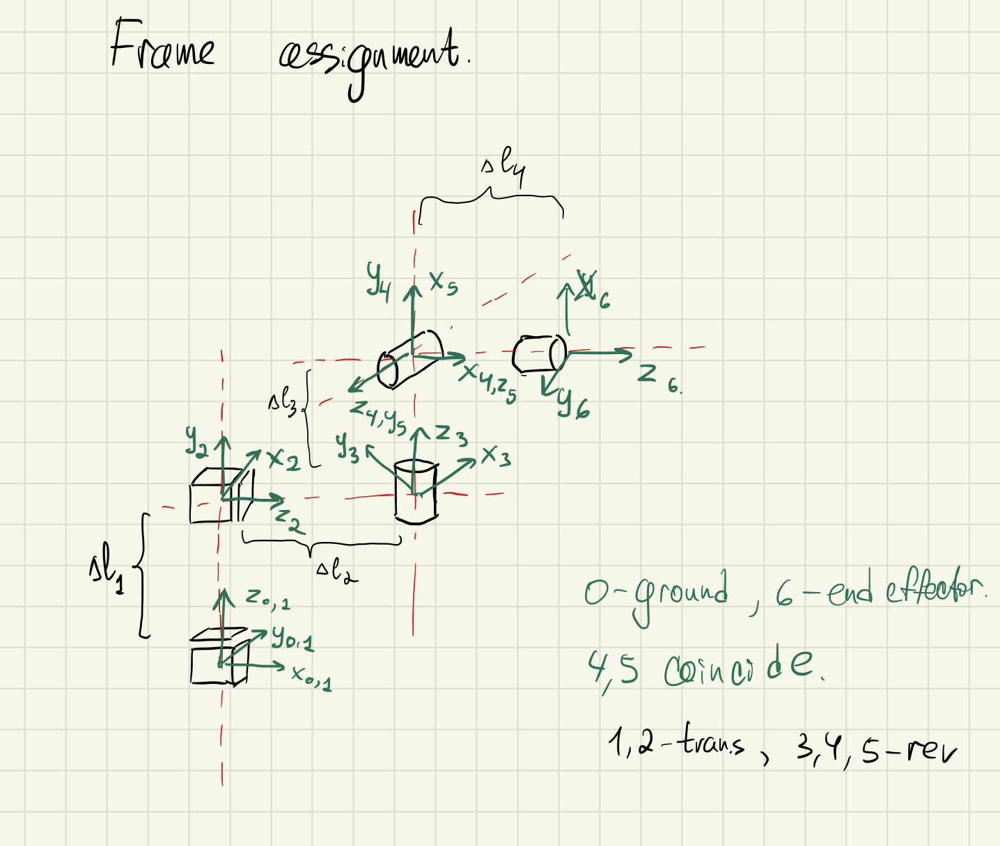

# Assignment 2

- [Assignment 2](#assignment-2)
  - [Current configuration - ZXZYX](#current-configuration---zxzyx)
  - [Mechanism Characteristics](#mechanism-characteristics)
  - [Frame Assignments](#frame-assignments)
  - [DH-Table](#dh-table)
  - [Forward Kinematics](#forward-kinematics)

## Current configuration - ZXZYX

Even though it was not required by an assignment to create a spherical wrist out of revolute joints, after a brief discussion with the TA it seems that it is just slightly better. Therefore I have decided to fix my configuration to suit this recommendation.

## Mechanism Characteristics

1. **Translational Z**: 0.1 x 0.1 x 0.5
2. **Translational X**: 0.1 x 0.1 x 0.5
3. **Revolute Z**: l = 0.2, r = 0.1
4. **Revolute Y**: l = 0.2, r = 0.1
5. **Revolute X**: l = 0.2, r = 0.1

## Frame Assignments

Frame assignments of the ROS configuration should be ignored, since they are placed for convinience of drawing. You can find the actual frame assignments on the following image:

## DH-Table

| Joints | a                | alpha    | d | theta   |
|--------|------------------|----------|---|---------|
| 1      | 0                | 0        | 0 | 0       |
| 2      | pi / 2           | pi / 2   | 0 | d1 + l1 |
| 3      | 0                | - pi / 2 | 0 | d2 + l2 |
| 4      | -pi / 2 + theta1 | pi / 2   | 0 | l3      |
| 5      | pi / 2 + theta2  | pi /  2  | 0 | 0       |
| 6      | theta3           | 0        | 0 | l4      |

## Forward Kinematics

Having completed DH-Table, we can now calculate the forward kinematics easilly following the conventions:

$$T^{n-1}_{n} = Z_{n-1} \cdot X_{n}$$

Where:

$$Z_{i} = T_{z_i}(d_i) \cdot R_{z_i}(\theta_i)$$
$$X_i = T_{x_i}(r_i) \cdot R_{x_i}(\alpha_i)$$

$$T = T^0_1 \cdot T^1_2 \cdot T^2_3 \cdot T^3_4 \cdot T^4_5 \cdot T^5_6$$

Knowing the form of translation and rotation matrices, we can simply plug in the values of the DH table and calculate the transformation matrix. The result is as follows:

$$
T = 
\left[\begin{matrix}\sin{\left(\operatorname{q_{3}}{\left(t \right)} \right)} \sin{\left(\operatorname{q_{5}}{\left(t \right)} \right)} - \sin{\left(\operatorname{q_{4}}{\left(t \right)} \right)} \cos{\left(\operatorname{q_{3}}{\left(t \right)} \right)} \cos{\left(\operatorname{q_{5}}{\left(t \right)} \right)} & \sin{\left(\operatorname{q_{3}}{\left(t \right)} \right)} \cos{\left(\operatorname{q_{5}}{\left(t \right)} \right)} + \sin{\left(\operatorname{q_{4}}{\left(t \right)} \right)} \sin{\left(\operatorname{q_{5}}{\left(t \right)} \right)} \cos{\left(\operatorname{q_{3}}{\left(t \right)} \right)} & \cos{\left(\operatorname{q_{3}}{\left(t \right)} \right)} \cos{\left(\operatorname{q_{4}}{\left(t \right)} \right)} & l_{2} + l_{4} \cos{\left(\operatorname{q_{3}}{\left(t \right)} \right)} \cos{\left(\operatorname{q_{4}}{\left(t \right)} \right)} + \operatorname{q_{2}}{\left(t \right)}\\ - \sin{\left(\operatorname{q_{3}}{\left(t \right)} \right)} \sin{\left(\operatorname{q_{4}}{\left(t \right)} \right)} \cos{\left(\operatorname{q_{5}}{\left(t \right)} \right)} - \sin{\left(\operatorname{q_{5}}{\left(t \right)} \right)} \cos{\left(\operatorname{q_{3}}{\left(t \right)} \right)} & \sin{\left(\operatorname{q_{3}}{\left(t \right)} \right)} \sin{\left(\operatorname{q_{4}}{\left(t \right)} \right)} \sin{\left(\operatorname{q_{5}}{\left(t \right)} \right)} - \cos{\left(\operatorname{q_{3}}{\left(t \right)} \right)} \cos{\left(\operatorname{q_{5}}{\left(t \right)} \right)} & \sin{\left(\operatorname{q_{3}}{\left(t \right)} \right)} \cos{\left(\operatorname{q_{4}}{\left(t \right)} \right)} & l_{4} \sin{\left(\operatorname{q_{3}}{\left(t \right)} \right)} \cos{\left(\operatorname{q_{4}}{\left(t \right)} \right)}\\ \cos{\left(\operatorname{q_{4}}{\left(t \right)} \right)} \cos{\left(\operatorname{q_{5}}{\left(t \right)} \right)} & - \sin{\left(\operatorname{q_{5}}{\left(t \right)} \right)} \cos{\left(\operatorname{q_{4}}{\left(t \right)} \right)} & \sin{\left(\operatorname{q_{4}}{\left(t \right)} \right)} & l_{1} + l_{3} + l_{4} \sin{\left(\operatorname{q_{4}}{\left(t \right)} \right)} + \operatorname{q_{1}}{\left(t \right)}\\ 0 & 0 & 0 & 
$$